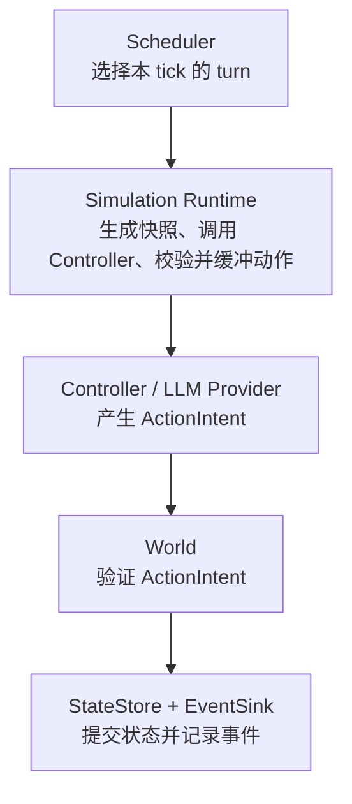
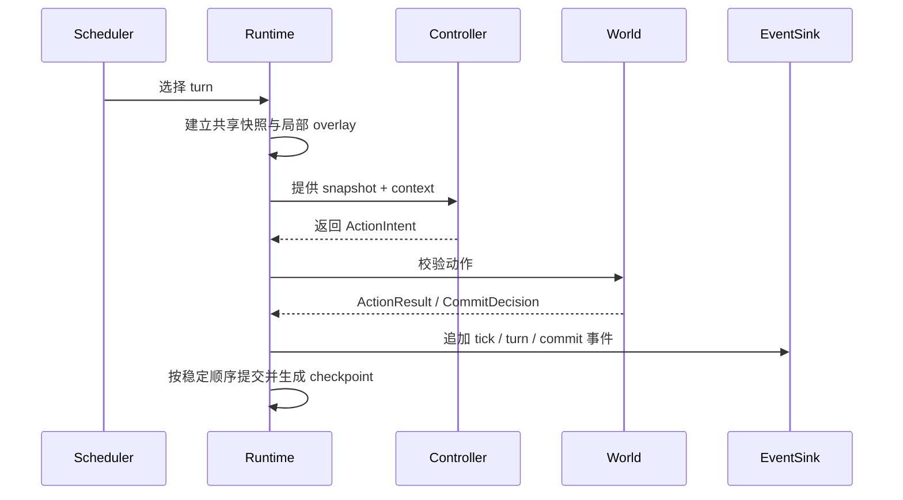
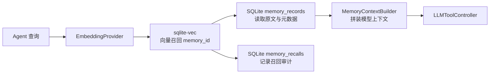
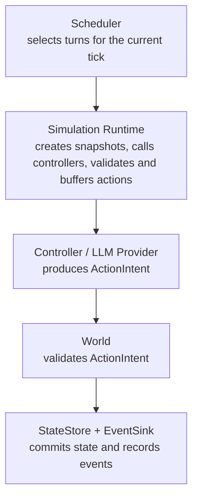
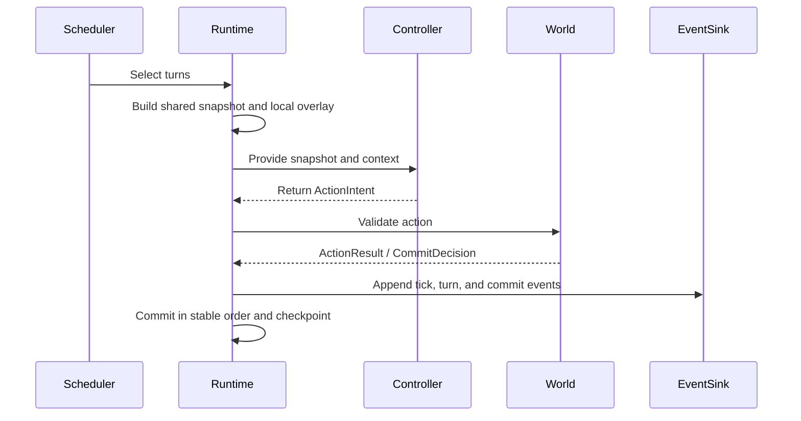
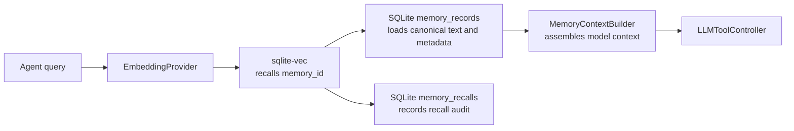

# Worldline Engine

Worldline Engine 是多 Agent 仿真的执行核心，负责 tick、快照、turn 预算、
缓冲写入、确定性冲突解决、checkpoint、事件和回放边界。领域规则、提示词、
记忆系统和模型供应商都可以作为可替换扩展接入。

### 项目定位

Worldline Engine 不限定社交平台、市场、组织、游戏或其他领域。它只规定
Agent 如何观察世界、提出结构化动作，以及 World 如何验证和提交动作。

核心保证：

- 同一 tick 内所有 turn 从一致的只读快照开始。
- Agent 只能看到自己的本轮局部写入，不能看到其他 Agent 的未提交变化。
- 写动作在 tick 结束时按稳定顺序统一提交。
- 事件以追加方式记录，状态可以通过 checkpoint 恢复。
- Controller、World、StateStore、EventSink 和 ModelProvider 都可替换。

### 架构边界



### Tick 生命周期



### 记忆召回流程



| 模块 | 职责 |
| --- | --- |
| `protocols.py` | Entity、Turn、Action、World、Controller、存储和事件协议 |
| `scheduler.py` | 全量和随机激活策略，不调用模型、不修改世界 |
| `runtime.py` | tick/turn 生命周期、预算、快照、局部 overlay、确定性提交 |
| `controllers.py` | Rule、Replay 和通用 LLM tool-call Controller |
| `providers/` | DeepSeek 及未来模型供应商适配器 |
| `worlds.py` | 验证协议的最小冲突 World |
| `stores.py` | SQLite checkpoint、原始记忆和召回审计 |
| `events.py` | JSONL 和 SQLite 追加事件 |
| `memory.py` | embedding、MemoryProvider、上下文拼装 |
| `vector.py` | 可选 `sqlite-vec` 向量索引 |

### 安装与验证

项目要求 Python 3.11 或更高版本。

```powershell
python -m pip install -e .
python -m unittest discover -s tests -v
python -m compileall -q src tests examples scripts
python -m pip wheel . --wheel-dir dist --no-deps
```

向量记忆和本地 embedding 是可选组件：

```powershell
python -m pip install -e ".[vector]"
python -m pip install -e ".[embedding]"
```

### 运行示例

```powershell
python examples/counter_simulation.py
```

### 记忆注入与召回

脚本可以生成大量确定性记忆，适合快速测试存储、过滤、召回和上下文长度：

```powershell
python scripts/seed_memories.py `
  --database runs/memory-demo/experiment.sqlite `
  --count 1000 `
  --person-id person-000 `
  --query "solar energy research" `
  --limit 5
```

`HashEmbeddingProvider` 用于离线测试和压力测试，不代表生产级语义质量。
生产实验可以使用 `SentenceTransformerEmbeddingProvider`。完整记忆原文、
元数据和召回记录保存在 SQLite；`sqlite-vec` 只保存向量和 `memory_id`。

每次上下文召回可以记录：

```text
simulation_id, tick_id, turn_id, person_id, query, memory_ids
```

回放时应使用已记录的 `memory_ids` 和原文，不应依赖已经变化的向量索引。

### 模型供应商

当前内置 DeepSeek OpenAI-compatible Provider：

```powershell
$env:DEEPSEEK_API_KEY = "<your-key>"
```

```python
from worldline_engine import LLMToolController
from worldline_engine.providers import DeepSeekProvider

controller = LLMToolController(
    provider=DeepSeekProvider.from_environment(),
    model="deepseek-v4-flash",
)
```

Provider 不进入运行时核心。新增供应商只需实现统一的
`ModelProvider.complete()`，把厂商 tool-call 转成 `ModelToolCall`，再注册
Provider factory。未来可以独立加入 OpenAI、Anthropic、Gemini、Qwen、
Ollama 或 vLLM 适配器。

### 当前状态

已实现：

- 确定性 tick/turn 执行和冲突提交
- Rule、Replay、LLM tool-call Controller
- DeepSeek Provider
- SQLite checkpoint、事件、原始记忆和召回审计
- `sqlite-vec` 向量召回
- 批量记忆注入与 300/1000 条上下文测试

仍在演进：

- 多进程/分布式执行
- 多供应商正式适配器
- 生产级 embedding 评估和向量索引基准
- 社交、市场等具体领域 World

### 许可证

Apache License 2.0，详见 [`LICENSE`](LICENSE)。

---

## Positioning

Worldline Engine is a domain-neutral execution core for deterministic,
replayable, discrete-time multi-agent simulations. It does not impose social
media, market, organization, or game semantics.

The runtime guarantees a shared tick snapshot, turn-local write overlays,
stable write ordering, append-only events, and checkpoint recovery. Domain
rules live in `World`; decision logic lives in `Controller`; model vendors live
in `providers/`.

## Architecture boundaries



## Tick lifecycle



## Memory recall flow



| Module | Responsibility |
| --- | --- |
| `protocols.py` | Entity, turn, action, world, controller, storage, and event protocols |
| `scheduler.py` | Full and random activation policies; no model calls or world mutation |
| `runtime.py` | Tick/turn lifecycle, budgets, snapshots, local overlays, deterministic commits |
| `controllers.py` | Rule, replay, and generic LLM tool-call controllers |
| `providers/` | DeepSeek and future model-provider adapters |
| `worlds.py` | Minimal conflict-testing world |
| `stores.py` | SQLite checkpoints, canonical memories, and recall audits |
| `events.py` | JSONL and SQLite append-only events |
| `memory.py` | Embeddings, memory providers, and context assembly |
| `vector.py` | Optional `sqlite-vec` vector index |

## Install and verify

```powershell
python -m pip install -e .
python -m unittest discover -s tests -v
python -m compileall -q src tests examples scripts
python -m pip wheel . --wheel-dir dist --no-deps
```

Optional local vector and embedding components:

```powershell
python -m pip install -e ".[vector]"
python -m pip install -e ".[embedding]"
```

## Running the example

```powershell
python examples/counter_simulation.py
```

## Memory and recall

The seeding script creates deterministic memories for testing storage,
filtering, recall, and context size:

```powershell
python scripts/seed_memories.py `
  --database runs/memory-demo/experiment.sqlite `
  --count 1000 `
  --person-id person-000 `
  --query "solar energy research" `
  --limit 5
```

`HashEmbeddingProvider` is intended for offline tests and stress tests, not
production semantic quality. Experiments can use
`SentenceTransformerEmbeddingProvider`. Full memory text, metadata, and recall
records remain in SQLite; `sqlite-vec` stores vectors and `memory_id` values.

Each recall can record:

```text
simulation_id, tick_id, turn_id, person_id, query, memory_ids
```

Replay should use the recorded `memory_ids` and canonical text instead of
depending on a vector index that may have changed.

## Providers

The built-in DeepSeek provider uses the OpenAI-compatible endpoint:

```powershell
$env:DEEPSEEK_API_KEY = "<your-key>"
```

```python
from worldline_engine import LLMToolController
from worldline_engine.providers import DeepSeekProvider

controller = LLMToolController(
    provider=DeepSeekProvider.from_environment(),
    model="deepseek-v4-flash",
)
```

Providers do not enter the runtime core. A new vendor implements
`ModelProvider.complete()`, normalizes vendor tool calls into `ModelToolCall`,
and registers a provider factory. OpenAI, Anthropic, Gemini, Qwen, Ollama, and
vLLM adapters can be added independently.

## Current status

Implemented:

- Deterministic tick/turn execution and conflict commits
- Rule, replay, and LLM tool-call controllers
- DeepSeek provider
- SQLite checkpoints, events, canonical memories, and recall audits
- `sqlite-vec` vector recall
- Batch memory injection and 300/1000-context tests

Evolving:

- Multi-process and distributed execution
- Formal multi-provider adapters
- Production embedding evaluation and vector-index benchmarks
- Domain-specific social, market, and organization worlds

## License

Apache License 2.0. See [`LICENSE`](LICENSE).
